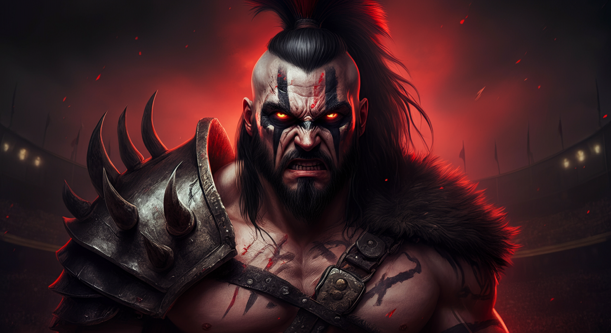

# ⚔️ EL BRUTO - Arena PvP

My Brute-style PvP fighting game. Create a character, level up, and fight other players in auto-combat battles.

🎮 **Play now:** [bruto.aibot0x.com](https://bruto.aibot0x.com)

## Features

- 🧙 6 character classes: Guerrero, Berserker, Caballero, Ninja, Mago, Arquero
- ⚔️ Auto-combat with detailed battle logs
- 📈 Level up system with stat progression
- 🏆 Leaderboard and fight history
- 🎨 Pixel-art character avatars
- 📱 Mobile-friendly

## Screenshots

     

## Quick Start

```bash
git clone https://github.com/arturogj92/bruto-game.git
cd bruto-game
npm install
npm start
```

Open http://localhost:3481

## Tech Stack

- **Backend:** Node.js + Express
- **Database:** SQLite (better-sqlite3)
- **Frontend:** Vanilla JS SPA
- **Styling:** Custom CSS with pixel-art theme

## API

| Method | Endpoint | Description |
|--------|----------|-------------|
| GET | `/api/players` | List all players |
| GET | `/api/player/:slug` | Get player + character |
| POST | `/api/player/:slug/character` | Create character |
| GET | `/api/character/:id` | Character details |
| POST | `/api/fight` | Start a fight |
| GET | `/api/leaderboard` | Rankings |

## Contributing

PRs welcome! Fork, create a branch, make your changes, and open a pull request.

## License

MIT
